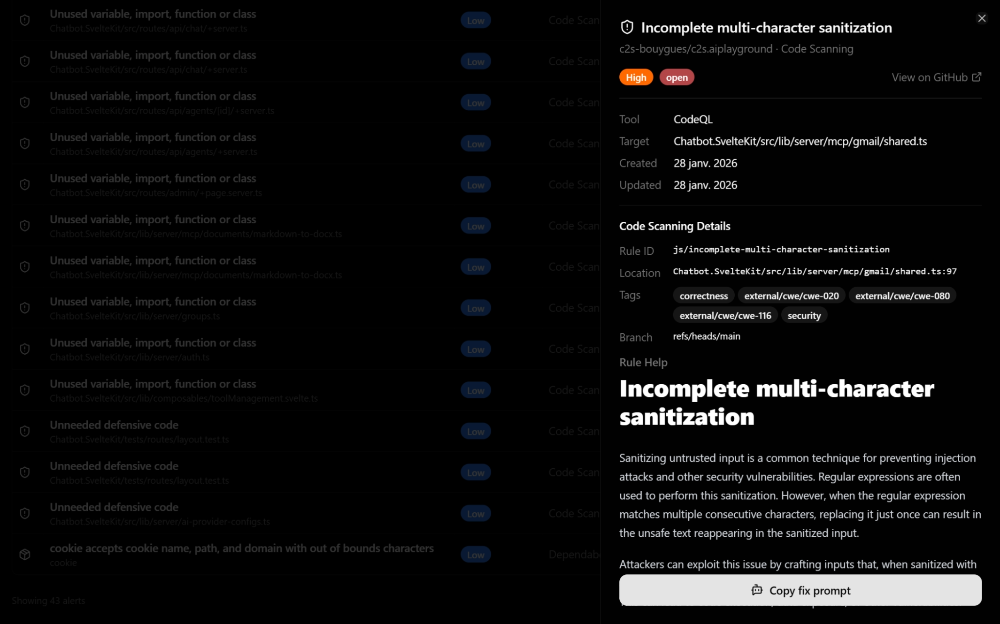

# GitHub Security Dashboard

A dashboard that aggregates code scanning, secret scanning, and Dependabot alerts from your GitHub repositories into a unified interface.

From an idea of [AnceretMatthieu](https://github.com/AnceretMatthieu).



## Setup

```bash
npm install
```

Copy `.env.example` to `.env` and fill in:

```
GITHUB_PAT=<your token with security_events scope>
DASHBOARD_REPOS=owner/repo1,owner/repo2
ALERT_CACHE_TTL_SECONDS=300
```

## Development

```bash
npm run dev
```

## Build

```bash
npm run build
npm run preview
```

## Target Repository Setup

To generate code scanning alerts that this dashboard can display, add the following GitHub Actions workflow to your target repositories at `.github/workflows/codeql.yml`:

```yaml
name: "CodeQL Advanced"

on:
  push:
    branches: [ "main" ]
  pull_request:
    branches: [ "main" ]
  schedule:
    - cron: '33 15 * * 4'

jobs:
  analyze:
    name: Analyze (${{ matrix.language }})
    runs-on: ${{ (matrix.language == 'swift' && 'macos-latest') || 'ubuntu-latest' }}
    permissions:
      security-events: write
      packages: read
      actions: read
      contents: read

    strategy:
      fail-fast: false
      matrix:
        include:
        - language: actions
          build-mode: none
        - language: csharp
          build-mode: none
        - language: javascript-typescript
          build-mode: none

    steps:
    - name: Checkout repository
      uses: actions/checkout@v6

    - name: Initialize CodeQL
      uses: github/codeql-action/init@v4
      with:
        languages: ${{ matrix.language }}
        build-mode: ${{ matrix.build-mode }}
        queries: security-and-quality

    - name: Run manual build steps
      if: matrix.build-mode == 'manual'
      shell: bash
      run: |
        echo 'Manual build mode requires custom build commands.'
        exit 1

    - name: Perform CodeQL Analysis
      uses: github/codeql-action/analyze@v4
      with:
        category: "/language:${{matrix.language}}"
```

Adjust the `matrix.include` languages to match your repository (e.g., `python`, `java`, `go`, `ruby`, `swift`, `cpp`). The `security-and-quality` query suite provides both security vulnerability detection and code quality checks.

## License

[MIT](LICENSE)
